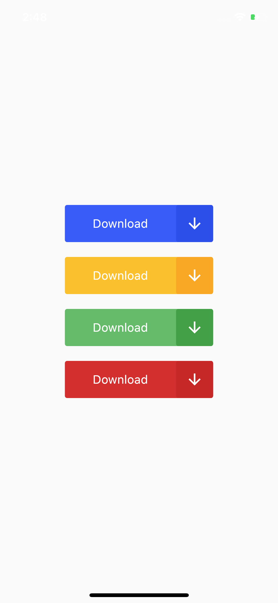
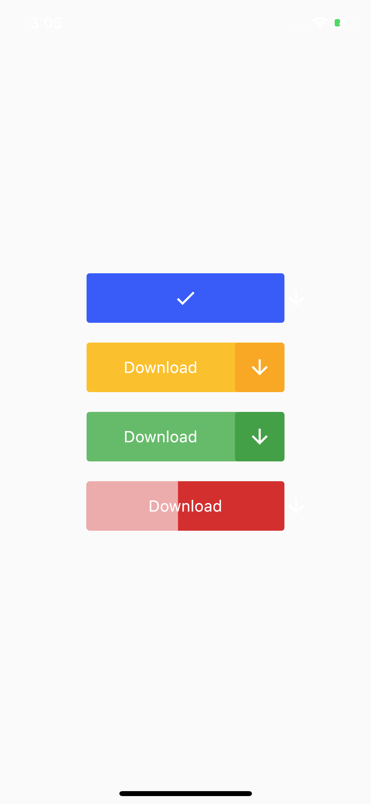

# Flutter Button Animation, Application Design - Day 7

Let's see how we can animate a button in Flutter.

[Youtube Video](https://youtu.be/WsbMf9IiWGo)

## ScreenShot

&nbsp;

## Structure du Projet

**lib/**: Contient le code source de l'application.
  - **main.dart**: Point d'entrée de l'application.
  
  - **pages/**: Contient les pages de l'application.
    - **home_page.dart**: Page d'accueil qui affiche les boutons animés.

  - **animation/**: Contient les animations utilisées dans l'application.
    - **fade_animation.dart**: Définition de l'animation des boutons.

## Description des fichiers

1. main.dart

- Ce fichier est le point d'entrée de l'application Flutter. Il initialise l'application et affiche la page d'accueil.

2. pages/home_page.dart

- Ce fichier définit la page d'accueil de l'application. Il utilise la classe `ButtonAnimation` pour afficher quatre boutons animés de différentes couleurs. Les boutons sont centrés sur l'écran, et chaque bouton est espacé de 20 pixels l'un de l'autre.

3. animation/fade_animation.dart

- Ce fichier contient la classe `ButtonAnimation`, qui définit une animation pour les boutons. Voici une explication des principales parties de ce fichier :

    - **ButtonAnimation** :
        - Cette classe est un widget d'état (StatefulWidget) qui permet d'animer un bouton.
        - Les couleurs du bouton sont passées en tant que paramètres (`primaryColor` et `darkPrimaryColor`).

    - **_ButtonAnimationState** :
        - Cette classe gère l'état et l'animation du bouton.
        - **_animationController** : Contrôle l'animation de la largeur du bouton.
        - **_scaleAnimationController** : Gère l'animation de mise à l'échelle (zoom) du bouton lorsqu'il est cliqué.
        - **_fadeAnimationController** : Gère l'animation de disparition de l'icône de flèche.
        - **_animation** : Anime la largeur du bouton.
        - **_scaleAnimation** : Anime l'effet de zoom du bouton.
        - **_fadeAnimation** : Anime la transparence de l'icône de flèche.

    - **initState()** :
        - Initialise les contrôleurs d'animation et définit les animations associées.

    - **dispose()** :
        - Libère les ressources utilisées par les contrôleurs d'animation lorsque le widget est supprimé.

    - **build()** :
        - Construit l'interface utilisateur du bouton animé en utilisant des `AnimatedBuilder` pour gérer les animations et des widgets `Stack` pour superposer les éléments animés.
        - Le bouton change de texte ("Download" à une icône de coche) une fois l'animation terminée.

